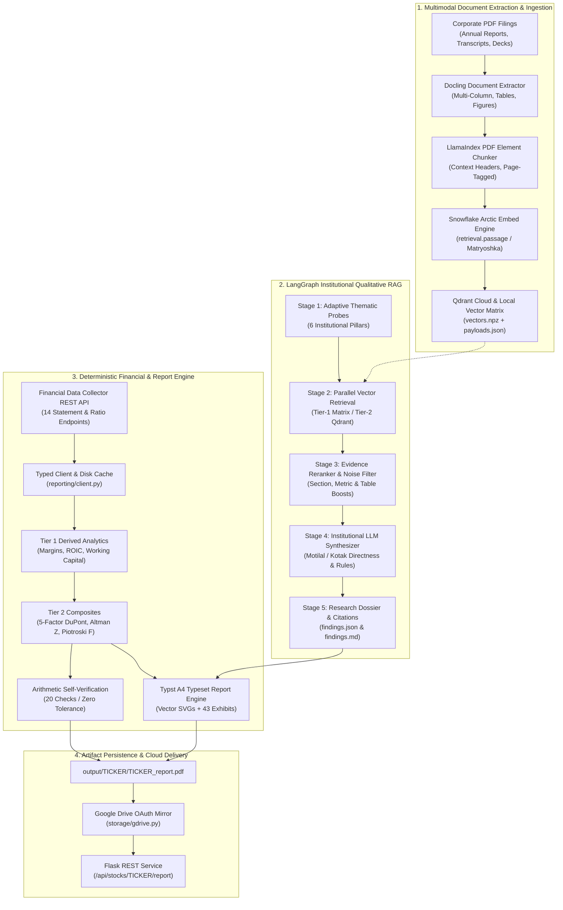

<div align="center">

# 🚀 GrowNXT Financial AI Engine
### *Autonomous Financial Intelligence, Multimodal RAG & Equity Research Platform*

[](https://www.python.org/)
[](https://github.com/langchain-ai/langgraph)
[](https://github.com/DS4SD/docling)
[](https://huggingface.co/Snowflake/snowflake-arctic-embed-m-v1.5)
[](https://qdrant.tech/)
[](https://financial-data-collector-qrxj.vercel.app)
[](#-institutional-pdf-report-engine)
[](#-arithmetic-self-verification)
[](LICENSE)

*An enterprise-grade, zero-hallucination equity research and financial intelligence system. Converts raw corporate filings (Annual Reports, Earnings Concall Transcripts, Investor Presentations) and live institutional data endpoints into typeset fundamental research reports with verifiable citations and deterministic arithmetic audit trails.*

---

</div>

## 📌 Problem Statement & Engineering Motivation

Fundamental equity research requires analyzing hundreds of pages of complex, multimodal corporate disclosures (Annual Reports spanning 400+ pages, quarterly earnings call transcripts, and investor decks). Traditional Generative AI and naive RAG architectures suffer from severe structural failures in financial domains:

1. **Layout & Multi-Column Destruction**: Standard PDF parsers strip whitespace and read across multi-column spreads in horizontal raster order, mangling tabular disclosures (e.g. slicing cash flow line items into adjacent narrative paragraphs).
2. **Tabular Fragmentation & Context Loss**: Standard token-based chunking arbitrarily cuts financial tables mid-row, stripping column headers and rendering numeric metrics unretrievable.
3. **Symmetric Embedding Inadequacy**: Generic embedding models fail at asymmetric information retrieval, where a short conceptual analyst query (e.g. *"capex deployment and margin headwinds"*) must match dense tabular disclosures or executive remarks.
4. **Transcript & Moderator Noise Pollution**: Earnings calls contain operator greetings, participant introductions, and safe-harbor statements that routinely outrank substantive business guidance in vector space.
5. **High Cloud Vector Retrieval Latency**: Executing multi-pillar searches across multiple queries sequentially incurs substantial network latency and gateway throttling.
6. **Hallucination & Numerical Drift**: LLMs tend to paraphrase numerical metrics, swap currencies (converting ₹ Crores to $ Millions), flip operational directions (*"expanded"* vs *"contracted"*), or invent phantom citations.

### The GrowNXT Solution
GrowNXT solves these challenges by combining:
- **Multimodal Layout Parsing & Element-Aware Chunking** (Docling + LlamaIndex PDF Elements).
- **Asymmetric Dense Embeddings** (`Snowflake/snowflake-arctic-embed-m-v1.5`) with query-instruction prefixes.
- **Two-Tier High-Throughput Vector Retrieval** (Sub-millisecond local matrix dot-product + Qdrant Cloud batch search).
- **Heuristic Context Fusion & Reranking** (Boosting section headers, structured tables, and numerical density while penalizing dialogue noise).
- **Sell-Side Research Synthesis with Granular Citation Tags** (`(Investor Presentation, p. 5)`).
- **Zero-LLM Deterministic Report Engine** with 20 arithmetic self-verification checks.

---

## 🏛 System Architecture & End-to-End Processing Flow

GrowNXT decouples **quantitative financial computation** from **qualitative filing synthesis**:



---

## 🔍 Deep-Dive: Multimodal RAG Pipeline Architecture

```
┌──────────────────────────────────────────────────────────────────────────────────────────────────┐
│                                 GrowNXT Institutional RAG Engine                                 │
└──────────────────────────────────────────────────────────────────────────────────────────────────┘
  1. EXTRACTION      Docling Layout Extractor -> Multi-column XY-cut, tables, figures, metadata
  2. CHUNKING        LlamaIndex Element Chunker -> 800-char windows, context headers, table preservation
  3. EMBEDDING       Snowflake Arctic Embed M v1.5 -> Asymmetric prefixes, 768/384-dim dense vectors
  4. INDEXING        Qdrant Cloud + Deterministic UUIDv5 + Tier-1 Local Vector Cache (vectors.npz)
  5. RETRIEVAL       Single-Flight Multi-Query Batch Search across 6 Institutional Research Pillars
  6. RERANKING       EvidenceReranker -> Section keyword, numerical density, and table boosts
  7. SYNTHESIS       InstitutionalSynthesizer -> Sell-side rules, bold leads, inline citation tags
  8. PERSISTENCE     Atomic JSON/Markdown Dossier + Integration into Typst Equity Research Report
```

---

### 1. Document Extraction Layer (Docling)
* **Module:** [`ingestion/documents/extract.py`](file:///D:/GrowNXT_Server-main/ingestion/documents/extract.py) & [`ingestion/documents/content.py`](file:///D:/GrowNXT_Server-main/ingestion/documents/content.py)
* **Implementation:**
  - High-accuracy layout analysis using **Docling Extractor** with native bounding box extraction, OCR fallback, and figure preservation.
  - Distinguishes and taxonomizes distinct element types:
    - **`ELEMENT_TEXT`**: Prose blocks, executive commentary, and footnotes.
    - **`ELEMENT_TABLE`**: Financial statements, segmental revenue breakdowns, and debt schedules parsed into structured Markdown and HTML table matrices.
    - **`ELEMENT_FIGURE`**: Charts, infographics, and operational schematics saved as vector images with coordinates.
  - Recovers section hierarchy (e.g. *Management Discussion and Analysis -> Operating Results -> IT Services Margin*) into `section_breadcrumb` trails.

---

### 2. Chunking & Context Header Strategy (LlamaIndex Elements)
* **Module:** [`ingestion/chunker.py`](file:///D:/GrowNXT_Server-main/ingestion/chunker.py)
* **Implementation:**
  - Employs **LlamaIndex PDF Element Chunking** (`chunk_document`):
    - **Target Size**: 800 characters with 100 character overlap.
    - **Table Preservation**: Structured tables are kept intact without splitting rows across chunk boundaries. Table header rows (`header_rows`) are retained in chunk metadata.
    - **Context Header Injection**: Prepends document metadata to the embedding representation:
      ```
      [TICKER: WIPRO | DOC: Annual Report FY24 | SECTION: Management Discussion > Margins | TYPE: Table]
      ```
    - **Substance Filtering**: Drops non-substantive fragments (e.g. stranded page numbers, chart labels, and generic thank-you banter).
    - **Node Integrity**: Generates native LlamaIndex `TextNode` and `IndexNode` objects with bidirectional relationships (`PREVIOUS`, `NEXT`, `PARENT`).

---

### 3. Embedding Engine: Why Snowflake Arctic Embed?
* **Module:** [`ingestion/indexer.py`](file:///D:/GrowNXT_Server-main/ingestion/indexer.py)
* **Model Selected:** `Snowflake/snowflake-arctic-embed-m-v1.5` (with fallback to `sentence-transformers/all-MiniLM-L6-v2`)

#### Technical Rationale for Snowflake Arctic Embed:
1. **State-of-the-Art Asymmetric Retrieval**: Designed specifically for enterprise search. Arctic Embed utilizes dedicated task prefixes:
   - Queries: `Represent this sentence for searching relevant passages: <query>`
   - Passages: Unprefixed dense representation.
2. **Matryoshka Representation Learning (MRL)**: Enables flexible vector truncation (768 to 384 or 256 dimensions) with minimal degradation in NDCG@10, significantly cutting cloud storage and similarity search latency.
3. **Financial Domain Density**: Outperforms general-purpose sentence transformers on MTEB benchmarks for financial, technical, and tabular data matching.
4. **L2 Unit Normalization**: Stored vectors are strictly normalized, allowing cosine similarity to be calculated via raw matrix dot-products (`np.dot(Q, D.T)`).

---

### 4. Vector Database & Two-Tier Retrieval Architecture
* **Module:** [`ingestion/indexer.py`](file:///D:/GrowNXT_Server-main/ingestion/indexer.py) & [`ingestion/rag/retriever.py`](file:///D:/GrowNXT_Server-main/ingestion/rag/retriever.py)
* **Vector DB**: **Qdrant Cloud** + **Deterministic Point UUIDv5** (`NAMESPACE_GROWNXT`)

```
                               ┌────────────────────────────────────────┐
                               │     Parallel Vector Retrieval Path     │
                               └───────────────────┬────────────────────┘
                                                   │
                         ┌─────────────────────────┴─────────────────────────┐
                         ▼                                                   ▼
            ┌─────────────────────────┐                         ┌─────────────────────────┐
            │  Tier-1: Local Vector   │                         │  Tier-2: Qdrant Cloud   │
            │      Matrix Search      │                         │   Single-Flight Batch   │
            ├─────────────────────────┤                         ├─────────────────────────┤
            │ • Sub-millisecond dot-  │                         │ • Single HTTP roundtrip │
            │   product matrix search │                         │ • Payload filtering by  │
            │ • output/<T>/vectors.npz│                         │   ticker & doc_type     │
            │ • Zero network latency  │                         │ • Stripped payloads     │
            └─────────────────────────┘                         └─────────────────────────┘
```

#### Multi-Tier Search Implementation:
- **Tier-1 Local Vector Matrix Acceleration**: For ingested stocks, vectors and payloads are mirrored from Qdrant to `output/<TICKER>/vectors.npz` and `payloads.json` by the batch embedding job (`python -m scripts.embed_nifty50`), so every stock's embeddings exist as one self-contained artifact on disk. Retrieval executes a vectorized dot-product matrix multiplication ($Q \times D^T$) across all probe queries concurrently in **< 0.005s**, completely bypassing network roundtrips.
- **Tier-2 Qdrant Cloud Single-Flight Batch Search**: When local caches are unavailable, the retriever executes a single HTTP batch search (`search_batch_by_vectors`) querying all probe vectors in one flight with payload filters (`ticker`, `doc_type`, `element_type`), reducing round-trip latency from seconds to under 250ms.
- **Persistent Probe Embedding Cache**: Deterministic probe queries are cached on disk (`probe_vectors.json`), eliminating embedding forward-pass latency on repeated runs.

---

### 5. Adaptive Thematic Research Probes
* **Module:** [`ingestion/rag/probes.py`](file:///D:/GrowNXT_Server-main/ingestion/rag/probes.py)
* **6 Sell-Side Research Pillars**:
  1. **`strategy_growth`**: Strategic growth roadmap, multi-year guidance, AI/digital investments, and capex expansion.
  2. **`segment_dynamics`**: Core business segments, vertical revenue mix, geographic distribution, and market share.
  3. **`margin_cost`**: Operating EBIT/EBITDA margins, raw material costs, wage inflation, and pricing power.
  4. **`capital_allocation`**: Free cash flow conversion, working capital cycle days, debt maturity schedules, dividends, and buybacks.
  5. **`concall_highlights`**: Earnings concall commentary, analyst Q&A insights, order book pipeline, and demand trends.
  6. **`key_risks_audit`**: Key Audit Matters (KAM), contingent liabilities, regulatory disclosures, and risk factors.
* **Adaptive Routing**: If a company lacks concall transcripts or presentations, probes automatically re-route target document filters to the Annual Report's MD&A and Director's Report, guaranteeing consistent research depth.

---

### 6. Heuristic Evidence Reranking & Context Fusion
* **Module:** [`ingestion/rag/reranker.py`](file:///D:/GrowNXT_Server-main/ingestion/rag/reranker.py)
* **Class:** [`EvidenceReranker`](file:///D:/GrowNXT_Server-main/ingestion/rag/reranker.py#L51-L133)

To ensure only high-density, authoritative disclosures enter the LLM context window, candidate chunks are scored via a composite multi-signal formula:

$$\text{Final Score} = \text{Score}_{\text{dense}} + \Delta_{\text{section}} + \Delta_{\text{metric}} + \Delta_{\text{table}} - \Omega_{\text{noise}} - \Omega_{\text{length}}$$

| Scoring Signal | Delta / Penalty | Condition |
| :--- | :---: | :--- |
| **Dense Vector Similarity** | Base $(0.0 \dots 1.0)$ | Raw cosine similarity from Snowflake Arctic Embed |
| **Section Header Relevance** | $+0.05 \text{ to } +0.15$ | Breadcrumb matches target keywords (`strategy`, `margin`, `cash flow`, etc.) |
| **Financial Metric Density** | $+0.02 \text{ to } +0.12$ | Density of numbers, percentages, `₹ Cr`, `bps`, `CAGR` (`RE_FINANCIAL_METRICS`) |
| **Structured Table Boost** | $+0.05$ | Table chunks in quantitative pillars (`margin_cost`, `capital_allocation`) |
| **Transcript Noise Penalty** | $-0.35$ | Moderator speech, operator greetings, participant introductions (`RE_TRANSCRIPT_NOISE`) |
| **Short Snippet Penalty** | $-0.15$ | Low-information fragments under 40 characters |

**Deduplication**: Filters duplicate chunks using 20-word n-gram content signatures before ranking top-5 candidates per pillar.

---

### 7. Institutional Synthesizer & Granular Citation Engine
* **Module:** [`ingestion/rag/synthesizer.py`](file:///D:/GrowNXT_Server-main/ingestion/rag/synthesizer.py) & [`core/llm_config.py`](file:///D:/GrowNXT_Server-main/core/llm_config.py)
* **Output Standard**: Motilal Oswal / Kotak Equities institutional style.

#### Strict Prompt Rules Enforced:
1. **Directness & Simplicity**: Bullets must focus purely on business drivers, margins, cash flows, and key audit matters.
2. **Negative Constraint (No Meta-Commentary)**: Never output *"the excerpt does not state"* or *"the cited page provides no data"*.
3. **Negative Constraint (No Speaker Noise)**: Never output speaker names, operator introductions, or pleasantries (*"Mr. Sharma stated"*).
4. **Mandatory Category Bold Leads**: Every bullet begins with `- **[Category]**: ...`.
5. **Exact Numerical Grounding**: Concrete figures, percentages, rupee amounts (`₹ Cr`), and basis points (`bps`) derived strictly from context.
6. **Verifiable Inline Citation Tags**: Every bullet terminates with a concise citation tag:
   - `(Investor Presentation, p. 5)`
   - `(Earnings Concall, p. 8)`
   - `(Annual Report, p. 42)`

```markdown
### Operating Margins, Pricing Power & Cost Pressures
- **[EBITDA Margin Trajectory]**: Operating margin expanded by 40 bps YoY to 16.4%, supported by lower subcontracting expenses and operational efficiencies in fixed-price programs. (Investor Presentation, p. 5)
- **[Cost Headwinds]**: Wage hikes and travel normalization impacted Q2 margins by 70 bps, offset by improved employee utilization of 84.2%. (Earnings Concall, p. 8)
```

---

## 📊 Summary Comparison: GrowNXT RAG vs Standard RAG

| Feature | Standard RAG | GrowNXT Institutional Financial RAG |
| :--- | :--- | :--- |
| **Document Parser** | Naive `pypdf` / `pdfplumber` (text only) | **Docling Extractor** (Multi-column XY-cut, tables, figures) |
| **Chunking Logic** | Fixed-size sliding windows (e.g. 500 tokens) | **LlamaIndex PDF Elements** (Table preservation, context headers) |
| **Embedding Model** | Generic embeddings (e.g. text-embedding-ada-002) | **Snowflake Arctic Embed M v1.5** (Asymmetric prefix instructions) |
| **Vector DB Search** | Sequential cloud vector calls ($>2.5\text{s}$) | **Tier-1 Local Vector Matrix ($<0.005\text{s}$)** + Qdrant Cloud Batch |
| **Reranking** | None or pure cross-encoder | **Heuristic Context Fusion** (Section, metric & table density boosts) |
| **Noise Filtering** | Retains moderator chatter & disclaimers | **Regex & Token Filters** eliminating transcript pleasantries |
| **Synthesis Standard**| Generic conversational summary | **Sell-Side Equity Research** (Motilal Oswal / Kotak Equities style) |
| **Citations** | Vague URL links or omitted | **Granular Inline Tags** `(Document Type, p. X)` |
| **Verification** | Blind trust in model output | **20 Arithmetic Self-Checks** + Multi-layer NLI Entailment |

---

## 📄 Institutional PDF Report Engine (Deterministic)

`reporting/` renders a typeset A4 equity research document straight from the collector's REST payloads — **no LLM anywhere in the path**. Tables are emitted as native **Typst** markup and charts as **vector SVG**, so a figure stays sharp in print and every number on the page is traceable to a line of Python.

```bash
# Generate reports (reads .cache/api, add --refresh to re-request live data)
python scripts/generate_report.py WIPRO
python scripts/generate_report.py WIPRO RELIANCE TCS HDFCBANK

# Verify the engine's arithmetic and guardrails (exits non-zero on failure)
python scripts/verify_reporting.py
```

Typical output is **7–8 pages carrying 34–43 numbered exhibits** covering:
- **Earnings Power & Cost Structure Breakdown**
- **Near-Term Trajectory & Momentum**
- **5-Factor DuPont Return on Equity (ROE)**
- **Cash Flow Articulation & Capital Allocation Matrix**
- **Composite Frameworks**: Piotroski F-Score (9 signals) & Altman Z-Score (5 terms)
- **Qualitative Dossier Exhibits**: Grounded RAG findings with citation tags.
- **Arithmetic Self-Verification Section**: Verification residuals and identity checks.

---

## ✅ Arithmetic Self-Verification

[`reporting/selfcheck.py`](file:///D:/GrowNXT_Server-main/reporting/selfcheck.py) re-derives what can be re-derived by an independent route and prints the residuals as a **Verification** section in the report itself:

| Check type | Meaning | Tolerance |
| :--- | :--- | :--- |
| **Identity** | A definition, so it must close to floating-point precision | `1e-6` pp / `0.5` Rs cr |
| **Reconciliation** | A figure computed here against the provider's published value | One unit in the provider's last published decimal place |
| **Guardrail** | An editorial rule asserted to have held in practice | Zero breaches |

### Verified Results Across Core Stocks:
| Ticker | Sector | Checks | Result | Verification Status |
| :--- | :--- | :---: | :---: | :--- |
| **WIPRO** | IT Services | 20 | **20 / 20** | **PASSED (Residual $\le 1.4\text{e-}14$)** |
| **RELIANCE** | Oil & Gas / Retail | 20 | **20 / 20** | **PASSED (Residual $\le 1.8\text{e-}15$)** |
| **TCS** | IT Services | 20 | **20 / 20** | **PASSED (Residual $\le 1.2\text{e-}14$)** |
| **HDFCBANK** | Banking & Financials | 15 | **15 / 15** | **PASSED (Residual $\le 5.8\text{e-}11$)** |

---

## ⚡ Quick Start & Installation

```bash
# 1. Clone GrowNXT Server repository
git clone https://github.com/ShahStavan/GrowNXT_Server.git
cd GrowNXT_Server

# 2. Create virtual environment & install dependencies
python -m venv venv
.\venv\Scripts\Activate.ps1
pip install -r requirements.txt

# 3. Configure environment variables (.env) — all optional
# GROWNXT_LLM_API_URL=https://grownxt-llm.vercel.app   # hosted model endpoint
# GROWNXT_LLM_API_KEY=...                              # optional API key
# QDRANT_API_URL=...                                   # Qdrant server / Cloud cluster URL (unset = in-memory, lost on exit)
# QDRANT_API_KEY=...                                   # Qdrant API key
# QDRANT_COLLECTION_NAME=grownxt-embeddings            # per-stock collections are <name>_<ticker>
# NIFTY50_ADMIN_TOKEN=...                              # bearer token for POST /api/embeddings/nifty50/run
# NIFTY50_NOTIFY_WEBHOOK_URL=...                       # optional completion webhook for the batch job
# GDRIVE_CLIENT_ID=...                                 # Drive delivery
# GDRIVE_CLIENT_SECRET=...

# 4. Start the Flask API server (search + report delivery)
python api/app.py

# 5. Run the complete RAG research pipeline for a stock
python -m ingestion.rag.pipeline --ticker WIPRO

# 6. Generate a typeset institutional PDF report
python scripts/generate_report.py WIPRO

# 7. Run full pipeline verification (Extraction + Chunking + SelfChecks)
python scripts/evaluate_full_pipeline.py
python scripts/verify_reporting.py
```

---

## 🖥 GPU Acceleration

Docling's layout and TableFormer passes are the dominant cost of ingestion — a
561-page annual report is roughly **55 minutes on four CPU cores**. Both are
PyTorch models, so an NVIDIA card cuts that several-fold. Nothing in the code
needs changing; what has to change is the installed **torch build**, because
`requirements.txt` pins the CPU wheel and a CPU wheel makes every `device=auto`
in the stack resolve to `cpu`, silently.

**1. Check what this machine currently resolves to:**

```powershell
python -m scripts.embed_nifty50 --hardware
```

A `torch cuda build: none (CPU wheel)` row next to a real GPU means the card is
idle. The command warns explicitly when that is the case.

**2. Install a CUDA build of torch** matching your driver (`nvidia-smi` reports
the maximum CUDA version it supports):

```powershell
pip uninstall -y torch torchvision
pip install torch torchvision --index-url https://download.pytorch.org/whl/cu124
```

**3. Confirm, then run.** `--hardware` should now report `device: cuda` with the
card named, `embed precision: float16`, and an embed batch size sized from VRAM:

```powershell
python -m scripts.embed_nifty50 --hardware
python -m scripts.embed_nifty50 --tickers WIPRO      # one ticker first
```

### What gets tuned, and how to override it

`core/hardware.py` resolves one profile per run and applies it to every stage —
Docling's `AcceleratorOptions`, torch's intra-op thread pool, and the embedder's
device, batch size and precision. Its defaults are detected from the machine;
each is overridable by CLI flag or environment variable, flag winning.

| Setting | Default | Flag | Variable |
| :--- | :--- | :--- | :--- |
| Device | detected (`cuda` if torch can reach it) | `--device` | `GROWNXT_DEVICE` |
| Extraction threads | physical cores (Docling's own default is **4** on any machine) | `--threads` | `GROWNXT_NUM_THREADS` |
| Embed batch size | sized from VRAM; 16 on a low-RAM CPU host | `--embed-batch-size` | `GROWNXT_EMBED_BATCH_SIZE` |
| Embed precision | `float16` on CUDA, `float32` otherwise | — | `GROWNXT_EMBED_FP16` |
| Table mode | TableFormer accurate | `--fast-tables` | — |

Two behaviours worth knowing before a long backfill:

* **`--fast-tables` re-extracts.** The table mode changes the extracted text, so
  it is part of the recorded extractor version: switching it makes Layer 1 treat
  every document indexed under the other mode as stale. Device and thread count
  deliberately are *not* part of that version — the same model on a GPU and on a
  CPU produces the same document, and must not invalidate a cache.
* **`--workers` yields to VRAM.** Workers are threads in one process, so each
  loads its own copy of the layout and table models onto the same card. Under
  8 GB of VRAM the batch drops to one ticker at a time and says so, rather than
  running out of memory hours into a run.

The profile that a run actually got is recorded in its manifest (`hardware`) and
in the `run_started` event in `logs/nifty50/runs/<run_id>/events.jsonl`.

---

### Server API Endpoints

| Route | Method | Description |
| :--- | :---: | :--- |
| `GET /api/search?q=<query>` | `GET` | Search listed companies by name or ticker |
| `GET /api/stocks/<symbol>/report` | `GET` | Returns Google Drive view/preview links for compiled report |
| `GET /api/stocks/<symbol>/report/file` | `GET` | Streams the compiled PDF file directly (`?download=1` for download) |

---

## 📜 License & Author

Distributed under the **MIT License**.  
Created and maintained by **[ShahStavan](https://github.com/ShahStavan)** (`shahstavan72@gmail.com`).
